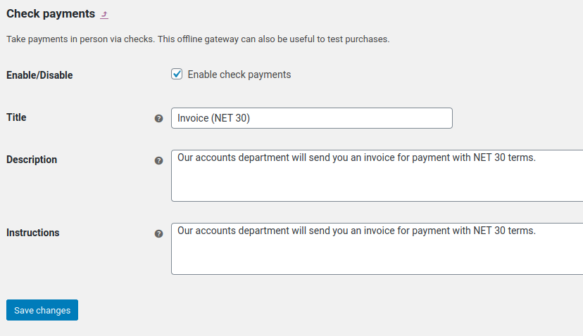
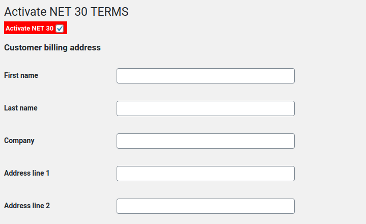
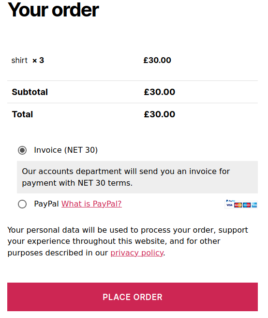
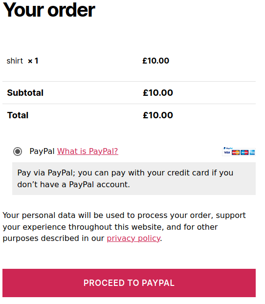

# Woocommerce NET 30 Terms

> NET 30 Terms in Woocommerce shouldn't be difficult.

## Demo Video

## Download and activate

Download the plugin, upload to your website and activate.

## Enable cheque option

This plugin uses the default 'cheque' payment option for checking out using NET 30 terms.

- Enable the cheque option
- Change the title to "NET 30 Terms" or w/e...
- Change the description/instructions to "Our accounts department will send you an invoice for payment with NET 30 terms." or w/e...

## Activate NET 30 for users

To enable NET 30 terms for a user, edit that user and scroll down to the NET 30 checkbox (highlighted in red).

Update, and test.

## Test Checkout

Assuming you've given yourself NET 30 Terms, you should be given the NET 30 checkout option. If you log out, it should be gone.

### Logged in user w/ NET 30 terms.

### User or guest w/o NET 30 terms

